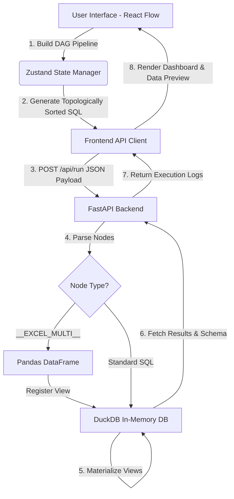

# Local Data Architect: Comprehensive Technical Dossier & Architecture Whitepaper

## 1. Abstract & Executive Summary
**Local Data Architect** is a standalone, high-performance Extract, Transform, Load (ETL) platform designed to bring enterprise-grade data orchestration capabilities directly to the local desktop environment. Built to mimic the visual node-based capabilities of tools like Tableau Prep or Alteryx, the platform allows users to visually design complex data transformation pipelines. Under the hood, it leverages an embedded **DuckDB** OLAP engine to execute SQL transformations in-memory at blazing speeds, bypassing the need for a dedicated database server. 

This document serves as a comprehensive technical specification, outlining the exact internal workings, data flow lifecycle, state management, API contracts, and packaging methodologies used to compile the React and FastAPI stack into a single zero-dependency Windows Executable.

---

## 2. System Architecture Overview

The platform operates on a classic Client-Server model, but uniquely executes entirely on `localhost` within a single process when compiled.

*   **Presentation Layer (Frontend):** React 18, TypeScript, Vite, `@xyflow/react` (React Flow), Zustand, Recharts.
*   **Orchestration Layer (Backend):** FastAPI, Uvicorn, Python 3.11.
*   **Execution Engine (Database):** DuckDB (In-memory mode), Pandas (for Excel bridging).
*   **Compilation Layer:** PyInstaller, custom Vite build scripts.

---

## 3. Frontend Internal Workings (Presentation Layer)

### 3.1. Visual Canvas & Node Graph (`@xyflow/react`)
The core interface is driven by React Flow. Nodes represent discrete data operations, and edges represent the flow of data (as SQL views) from one operation to the next.
*   **Custom Node Types:** The application registers custom node components (e.g., `TransformNode.tsx`, `DataSourceNode.tsx`) to render tailored UI elements on the canvas.
*   **Handles:** Each node possesses `Target` (Input) and `Source` (Output) handles, allowing users to pipe the output of one transformation into another.

### 3.2. State Management (`Zustand`)
The entire state of the canvas is synchronously managed by Zustand in `store.ts`. 
*   `nodes`: An array of node objects containing `id`, `type`, `position`, and `data` (which holds operation types, column selections, SQL snippets, etc.).
*   `edges`: An array dictating parent-child relationships.
*   `updateNodeData`: A crucial action that allows the `PropertiesPanel` to mutate the `data` payload of a specific node in real-time as the user types.

### 3.3. Topological Sorting & SQL Generation (`App.tsx`)
When the user initiates a pipeline execution, the frontend performs a critical translation process:
1.  **Graph Traversal:** Using Kahn's Algorithm, the frontend topologically sorts the nodes. This ensures that if Node B depends on Node A, Node A's SQL is executed and materialized in the database *before* Node B.
2.  **Parent Resolution:** For each node, the system identifies its incoming edges to determine its parent node IDs.
3.  **Dynamic SQL Templating:** Based on the node's `operation` property, the frontend injects the parent's generated view name into a SQL template.
    *   *Example (Filter Node):* `SELECT * FROM {parent_view} WHERE {condition}`
    *   *Example (Join Node):* `SELECT * FROM {parent_view_1} JOIN {parent_view_2} ON {condition}`

---

## 4. Backend Orchestration (API & Execution Layer)

### 4.1. The FastAPI Contract
The backend exposes a strictly typed RESTful API contract.
*   **`POST /api/run`**: Accepts the topologically sorted array of node objects.
*   **`GET /api/preview/{node_id}`**: Retrieves the schema (data types) and the first 100 rows of a specific materialized view for the Properties Panel.
*   **`GET /api/download/{view_name}`**: Triggers DuckDB to export a specific view to a temporary `.csv` file and streams it back to the client as a `FileResponse`.
*   **`GET /api/browse-file`**: Utilizes a hidden `tkinter` window to spawn a native OS file dialog, returning an absolute local path string to the frontend.

### 4.2. DuckDB Execution Pipeline (`main.py`)
DuckDB is initialized in purely in-memory mode (`duckdb.connect(':memory:')`). Upon receiving the `/api/run` payload, the backend iterates sequentially through the nodes.

1.  **View Materialization Engine:** For standard nodes, the backend wraps the frontend's generated SQL in a view creation statement:
    `duck_conn.execute(f"CREATE OR REPLACE VIEW node_{safe_node_id} AS {sql}")`
    This allows DuckDB to lazily evaluate queries and optimize the execution plan across the entire DAG.

2.  **The Pandas Bridge (`__EXCEL_MULTI__`)**: DuckDB lacks native Excel parsing. To circumvent this, the frontend generates a pseudo-command (`__EXCEL_MULTI__ ["path1", "path2"]`). 
    *   The backend intercepts this, parses the JSON array, and loads the files using `pandas.read_excel()`.
    *   The resulting DataFrames are concatenated and directly registered into DuckDB's memory space using `duck_conn.register(view_name, df)`.

3.  **Error Handling & Logging**: Execution is wrapped in granular `try/except` blocks. If a node fails (e.g., due to a SQL syntax error or missing column), the execution halts, and a detailed traceback is returned to the frontend's `Logs` tab, ensuring the user can debug their pipeline.

---

## 5. Node Operations Library

The platform supports over 30 distinct transformations, internally mapped to highly optimized DuckDB SQL dialects:

### 5.1. Data Input Nodes
*   **CSV / JSON / Parquet Input:** Translates to `read_csv_auto()`, `read_json_auto()`, and `read_parquet()` functions.
*   **Excel Input:** Intercepted by the Pandas Bridge.

### 5.2. Cleaning Nodes
*   **Remove Duplicates:** Translates to `SELECT DISTINCT * FROM parent`.
*   **Drop Nulls:** Iterates over user-selected columns to generate `WHERE col IS NOT NULL` clauses.
*   **Fill Nulls:** Utilizes `COALESCE(col, 'replacement_value')`.
*   **Rename Columns:** Employs the `AS` alias keyword in the `SELECT` projection.

### 5.3. Transformation & Aggregation Nodes
*   **Math Operations:** Dynamically parses equations (e.g., `col1 + col2`) into the `SELECT` projection.
*   **Group By (Aggregation):** Generates standard `GROUP BY` clauses, mapping user selections to aggregate functions like `SUM()`, `AVG()`, `COUNT()`, and `MAX()`.
*   **Pivot / Unpivot:** Leverages DuckDB's advanced native `PIVOT` and `UNPIVOT` syntax for complex cross-tabulations.

---

## 6. Data Visualization Engine (`Dashboard.tsx`)

The platform includes an embedded BI visualization suite powered by **Recharts**.
1.  **Data Extraction:** The Dashboard component polls the `/api/preview/{terminal_node}` endpoint to retrieve the final dataset.
2.  **Dynamic Axis Inference:** The component scans the data schema. It maps all numerical columns (e.g., `BIGINT`, `DOUBLE`) to a selectable Y-Axis dropdown, preventing users from attempting to map strings to numerical chart axes.
3.  **Chart Rendering:** The data array is fed directly into Recharts' `<LineChart>`, `<BarChart>`, `<ScatterChart>`, and `<PieChart>` components. The Pie chart automatically groups data by the selected X-Axis dimension, internally aggregating the Y-Axis metrics for display.

---

## 7. Packaging & Deployment Architecture

The most critical architectural requirement of the Local Data Architect is its ability to run as a zero-dependency standalone `.exe`. This is handled by the `build_exe.py` orchestrator.

### 7.1. Build Lifecycle
1.  **Vite Compilation:** The script executes `npm run build` in the `frontend` directory. Vite transpiles the TypeScript and bundles the React application into highly optimized, minified static files located in `frontend/dist`.
2.  **PyInstaller Assembly:** The script invokes PyInstaller on the `backend/main.py` file. 
    *   It uses `--add-data` to physically embed the `frontend/dist` directory into the final binary.
    *   It uses `--hidden-import` directives to force PyInstaller to include dynamically loaded libraries (like `pandas`, `openpyxl`, `duckdb`) that static analysis might miss.
3.  **Executable Generation:** PyInstaller bundles the Python interpreter, the standard library, the hidden imports, and the frontend assets into a single `LocalDataArchitect.exe` file.

### 7.2. Runtime Environment Resolution (`_MEIPASS`)
When a user double-clicks the `.exe`, PyInstaller extracts the embedded contents into a temporary directory in the user's `AppData/Local/Temp` folder (known as `_MEIPASS`).
*   `main.py` checks `getattr(sys, 'frozen', False)` to detect if it is running as a compiled binary.
*   If true, it calculates the path to the extracted `frontend/dist` directory inside `sys._MEIPASS`.
*   It instructs the FastAPI `StaticFiles` module to mount and serve this directory at the root (`/`) route.
*   Finally, a background thread is spawned that waits 1.5 seconds before invoking the Windows `webbrowser` module to automatically open `http://127.0.0.1:8000`, providing a seamless "Desktop App" experience.

---

## 8. Security & Sandbox Constraints
*   **Local Execution:** Because the FastAPI server is bound exclusively to `127.0.0.1`, it is inaccessible from external network interfaces, mitigating remote attack vectors.
*   **In-Memory Isolation:** DuckDB operates strictly in-memory. Terminating the application instantly destroys all materialized views and data artifacts, ensuring no sensitive data is left lingering on the disk (excluding explicitly exported files).
*   **Sanitization:** Node IDs are automatically sanitized (hyphens replaced with underscores) before being injected into SQL strings, preventing syntax injection errors within the DuckDB engine.
